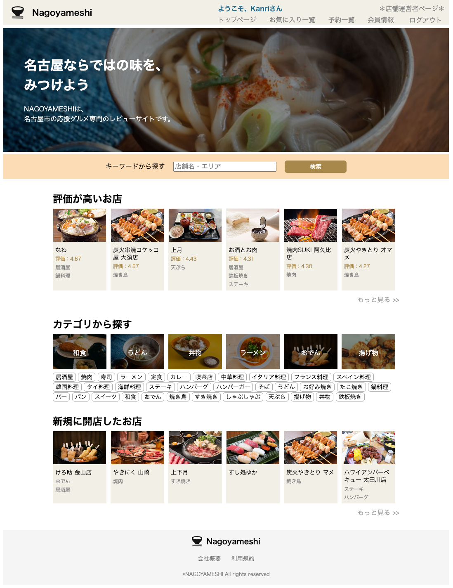
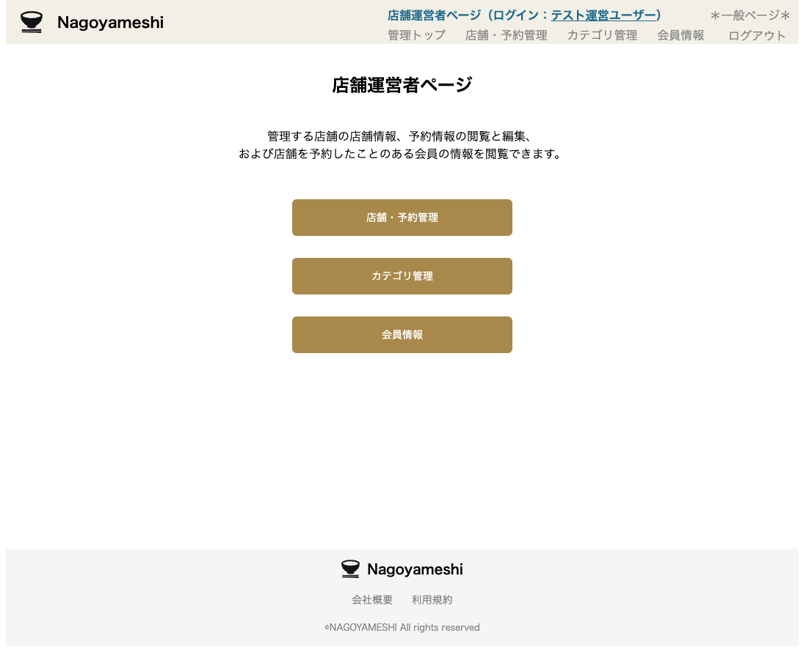

# Nagoyameshi
## 概要
Nagoyameshiは、名古屋市のグルメ情報を発信する架空のWebサイトです。ユーザーが店舗の情報を検索し、予約やレビューができる機能を提供しています。また、店舗運営者向けに店舗情報の管理や顧客情報の閲覧機能も実装しています。Djangoフレームワークを使用し、AWSのEC2とRDSを用いてクラウド環境にデプロイされています。

## URL
https://nagoyameshi.omochi-mochimental.net/

## 主な機能
### 一般会員向け
- **店舗検索機能**: ユーザーがキーワードやカテゴリを使って店舗を検索できます。
- **店舗情報閲覧機能**: 詳細な店舗情報を確認できます。
- **予約機能**: 店舗への予約が可能です。
- **レビュー機能**: ユーザーが店舗に対するレビューを投稿・閲覧できます。
- **お気に入り機能**: 気に入った店舗をお気に入りリストに追加できます。
### 店舗運営者向け
- **店舗情報管理機能**: 店舗情報の作成、閲覧、編集、削除が可能です。
- **予約情報管理機能**: 管理店舗の予約情報の閲覧、編集、削除が可能です。
- **会員情報閲覧機能**: 店舗に予約をした顧客の情報を確認できます。

## 使用技術
- フレームワーク: Django
- データベース: MySQL (AWS RDS)
- サーバー: AWS EC2
- フロントエンド: HTML, CSS, JavaScript

## サイトツリー

## サンプル画像
### 一般ユーザー用画面

### 店舗運営者用画面

