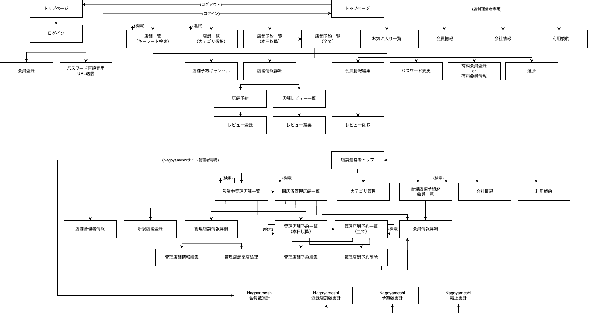
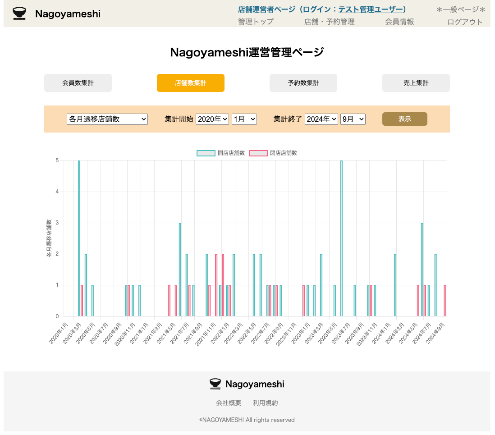

# Nagoyameshi
## 概要
Nagoyameshiは、名古屋市のグルメ情報を発信する架空のWebサイトです。ユーザーが店舗の情報を検索し、予約やレビューができる機能を提供しています。また、店舗運営者向けに店舗情報の管理や顧客情報の閲覧機能も実装しています。Djangoフレームワークを使用し、AWSのEC2とRDSを用いてクラウド環境にデプロイされています。

## URL
[侍エンジニアブログ](https://www.sejuku.net/blog/)

## 主な機能
### 一般会員向け
- **店舗検索機能**: ユーザーがキーワードやカテゴリを使って店舗を検索できます。
- **店舗情報閲覧機能**: 詳細な店舗情報を確認できます。
- **予約機能**: 店舗への予約が可能です。
- **レビュー機能**: ユーザーが店舗に対するレビューを投稿・閲覧できます。
- **お気に入り機能**: 気に入った店舗をお気に入りリストに追加できます。
### 店舗運営者向け
- **店舗情報管理機能**: 店舗情報の作成、閲覧、編集、削除が可能です。
- **予約情報管理機能**: 管理店舗の予約情報の閲覧、編集、削除が可能です。
- **会員情報閲覧機能**: 店舗に予約をした顧客の情報を確認できます。
### Nagoyameshiサイト管理者向け
- **会員数集計機能**: 会員数の集計が可能です。
- **店舗数集計機能**: 登録店舗数の集計が可能です。
- **予約数機能**: 全店舗または各店舗ごとの予約数の集計が可能です。
- **Nagoyameshi売上集計機能**: Nagoyameshiのサイト売上金額の集計が可能です。

## 使用技術
- フレームワーク: Django
- データベース: MySQL (AWS RDS)
- サーバー: AWS EC2
- フロントエンド: HTML, CSS, JavaScript

## こだわりポイント
- **ユーザビリティ向上のインターフェース**
ユーザーが直感的に操作できるよう、見やすさと使いやすさを重視したインターフェースを設計しました。

- **複数条件での検索と並び替え**
店舗や会員を検索する際、キーワードやカテゴリなど複数の条件を設定できる機能を実装。さらに、価格順や評価順での並び替えも可能にし、ユーザーが求める情報に素早くアクセスできるようにしました。

- **予約の利便性と現実的な制約**
実際の店舗運営を考慮し、予約やキャンセル可能な日付を制限。また、予約可能時間帯は各店舗の営業時間に合わせて自動で設定されるようにし、店舗運営者と一般ユーザーの双方にとって便利なシステムを構築しました。

- **クエリ最適化による高速表示**
データベースへのクエリの参照方法を工夫し、重い処理を軽減。ページの表示速度を向上させ、ユーザー体験を快適にするための最適化を行いました。

- **独自パーミッションによるアクセス制限**
他のユーザーの情報に不正にアクセスできないよう、独自のパーミッションシステムを導入。ユーザーごとにアクセス権を管理し、プライバシーを守る設計を徹底しました。

- **セキュリティ強化**
会員情報の検索や重要なデータの送信には、GETメソッドではなくPOSTメソッドを採用。外部へのデータ漏洩を防ぎ、セキュリティを強化する取り組みを行いました。

## サイトツリー

## サンプル画像
### 一般ユーザー用画面
#### サイトトップ

#### 店舗検索

#### 店舗詳細情報

### 店舗運営者用画面
#### 店舗運営者用トップ

#### 店舗管理

#### 予約管理

#### 会員情報

### Nagoyameshiサイト管理者用画面
#### 会員数集計

#### 店舗数集計

